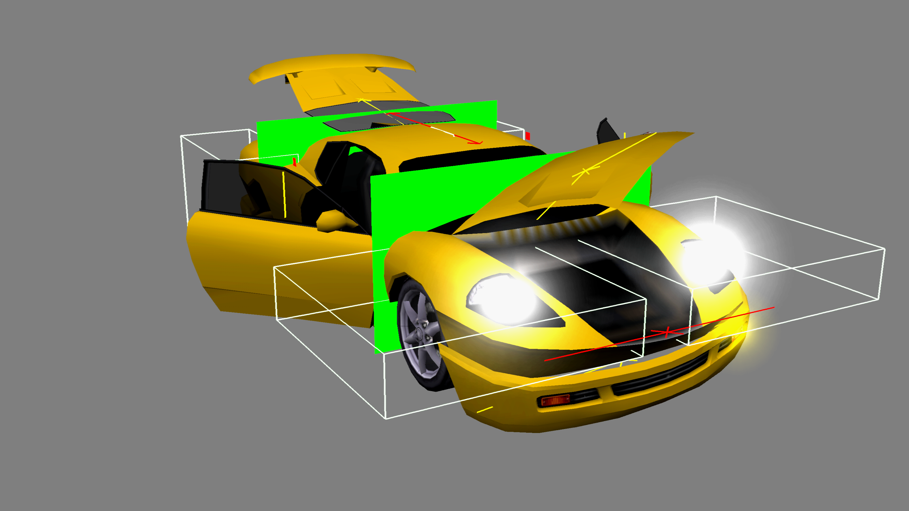

# Car Viewer

By using these patches you can start the "Car Viewer" debug feature left in the retail game. I made it accessible by pressing L2+R2+SQUARE on the vehicle of your choice in the rewards garage.
Real hardware versions can be found in the `PS2` folder.

## Default Bindings

These bindings were already present in the Car Viewer.

- SELECT: Go to main menu
- START: Change vehicle color
- L1, R1, CROSS, SQUARE, TRIANGLE, CIRCLE: Turn on various lights of the vehicle
- L2: Wheels backward
- R2: Wheels forward
- L3: Toggle debug visuals
- R3, DPAD DOWN: Vehicle deformation
- DPAD UP: Move hingeable parts (opens doors, hood, etc.)

## New Bindings

DPAD LEFT and DPAD RIGHT weren't used thus I bound them to the following actions:

- DPAD LEFT: Change background color
- DPAD RIGHT: Reset vehicle deformation

Note: If you press DPAD RIGHT while the hingeable parts are activated, they will move to the wrong way the next time you activate them, to fix this, just press DPAD RIGHT again while they are activated in the wrong way.

## Envmap leftovers

While running the Car Viewer, some envmap leftovers from the garage will be rendered on the vehicle (reflections, etc.), you can prevent this by checking "Disable envmap rendering".

## Modifiable lightning and background colors

The lightning of the vehicle seems to be handled by an irradiance map of 9 float values (coefficients), I don't know much about them but if the current map doesn't suit your needs, feel free to change it in the pnach file, I made it easily modifiable so you can perform lightning experiments.
The RGBA background colors used are also accessible in the pnach file (they're stored as little-endian, which means you have to reverse the byte order).
