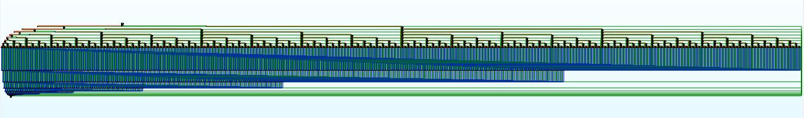

# PCSX2 Burnout 3: Takedown ELF Code Cave

## Inlineception?
While looking into the game executable, I noticed three huge functions in the disassembler:

`CB3TrafficVehicle::StartCrashing` (addr: 167D10) whose size is **37836** bytes
`CB3TrafficVehicle::Remove` (addr: 173D30) whose size is **75704** bytes
`CB3TrafficVehicle::Update` (addr: 186850) whose size is **77428** bytes

The first time I saw them I thought their size was intended but when I wanted to look deeper into traffic vehicles code I changed my mind, something probably went wrong during the game compilation process.

The issue seems to have happened when the compiler tried to do inline optimizations for the `Remove` function; its decompiled assembly should look like this:

```cpp
void CB3TrafficVehicle::Remove(CB3TrafficVehicle *this)
{
    this->mx8Flag = this->mx8Flag | 1;
    RemoveFromLanes(this);
    if (this->mpTrailerVehicle && (gWorld.mTrafficSystem.mbIsOnline || ((this->mx8OtherFlags & 2) == 0)))
    {
        Remove(this->mpTrailerVehicle);
    }
    CB3TrafficSystem::AddToDeadTrafficList(&gWorld.mTrafficSystem, this, true);
    this->mx8OtherFlags = '\0';
}
```

But instead, by looking at the disassembly you'll see that the compiler tried to inline the `Remove` call then inline the remove call into the inlined remove call and so on.

The graph overview of `StartCrashing` looks like this for example:


In `StartCrashing`, `Remove` can be called at one place only, the nested inlining seems to happen **128** times in it.
In `Update`, `Remove` can be called at two different places, the nested inlining seems to happen **256** times in it.
In `Remove`, the function can call itself at one place only, the nested inlining seems to happen **256** times in it.

These values sounds familiar, **128** is the max value for a signed char, and **256** the max value for an unsigned char, not sure if this information is useful to understand what happened behind the scenes though.

I checked the XBOX executable and none of this seems to have happened.

## Fixing
After fixing the functions, here are their new sizes:

`CB3TrafficVehicle::StartCrashing` -> **56** bytes (37780 free bytes)
`CB3TrafficVehicle::Remove` -> **124** bytes (75580 free bytes)
`CB3TrafficVehicle::Update` -> **1964** bytes (75464 free bytes)

(If you want more details go to the notes folder)

We have now ~188kb of free space in the retail ELF, however this free space is not contiguous, our code cave is split into three parts and there are also other functions between `StartCrashing` and `Update`.

These patches will take care of moving all the functions to the end of the fixed `StartCrashing`, the calls to the previous location of the moved functions are also fixed, nothing will change in the game except that we now have a huge code cave starting at 0x16B4F0, enjoy.
